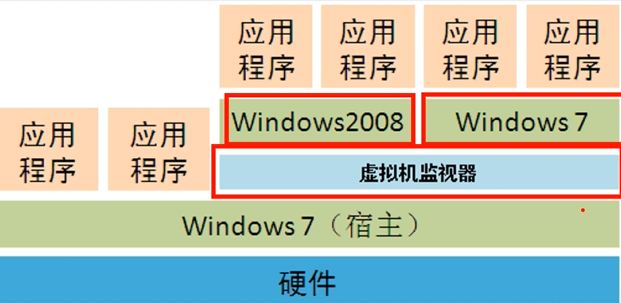
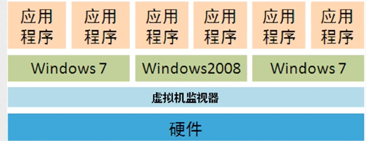

# ***虚拟化架构与程序部署***

### 虚拟机的运行架构

1. 寄居架构（实验环境、测试环境）

   * 硬件之上是宿主系统，
     宿主系统之上是虚拟机环境，
     虚拟机环境之上是虚拟系统。
     

   * 优点：
     虚拟机内各系统环境不影响宿主环境。

   * 缺点：

     一旦宿主环境遭到攻击而瘫痪，虚拟机将无法运行。

     ---

2. 原生架构（生产环境）
   * 虚拟机软件直接安装在计算机硬件上，
     虚拟机本身就是一个操作系统，
     在这个虚拟机上可以同时运行多个操作系统。
     

---

### 虚拟机产品

- VMware
  * VMware Workstation（寄居架构）
  * VMware vSphere（原生架构）

* 微软
  * Hyper-V（寄居架构）

---

### 安装环境

* VMware Workstation 12
* 8uftp

---