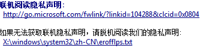
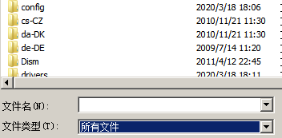

## 系统漏洞

### win7

1. 五次shift启动粘滞键

   
   该程序位于c:\Windows\System32\sethc.exe
   *于是设法将该程序掉包成cmd，改变user的密码*

2. 在出现windows启动界面时强制关机，让其出现故障
   

   1. 点修复

   2. 然后各种窗口，点击查看问题详细信息。
      
      
      此时，*脱机阅读要使用记事本打开*
      第一个C盘没有任何东西，应该打开本地磁盘D

   3. 记事本工具栏里有文件的选项，点击打开。

      
      
      要选择所有文件.

      进入c:\Windows\System32，将sethc.exe文件名字改掉。
      

   4. 将cmd.exe复制一份，并改名为sethc.exe，此时再使用粘滞键会打开cmd（*哈哈*）
      

      
      

3. 此时重新启动，再按五次shift
   此时进入的便是管理员账户

   然后net user shimisi “”
   就是讲shimisi密码设置为空。

   ---

   或者进入之后创建新用户并加入Administrators组里

   net user xinxin 123 /add

   net localgroup administrators /add

*记得走之前删除日志*

---

---

### 另，可用PE系统破解XP密码

需要U盘